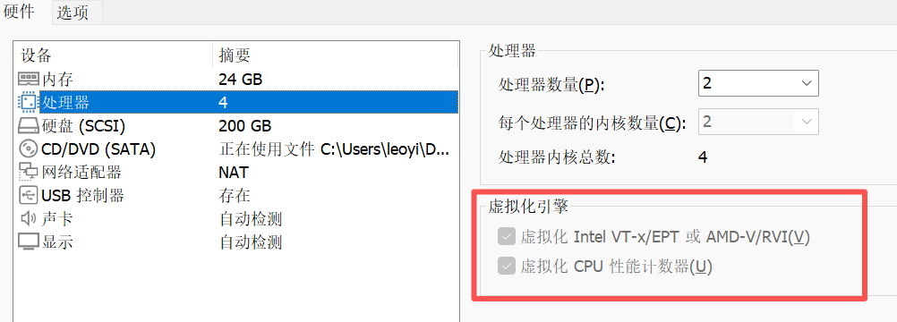
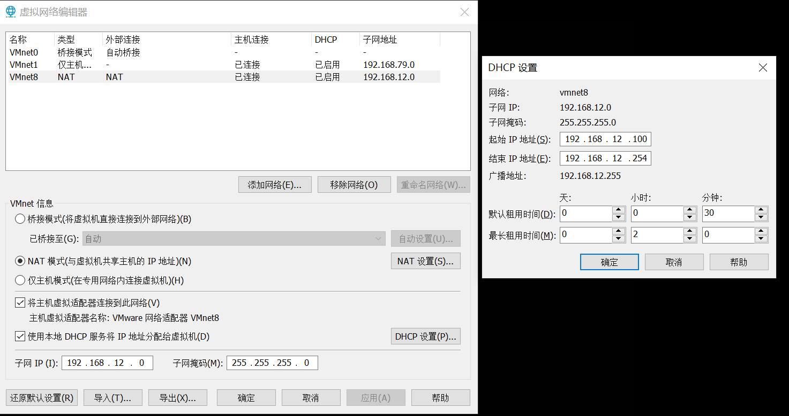
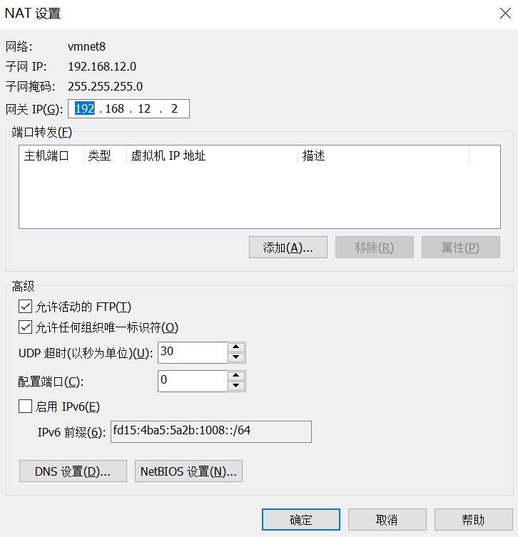
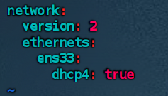
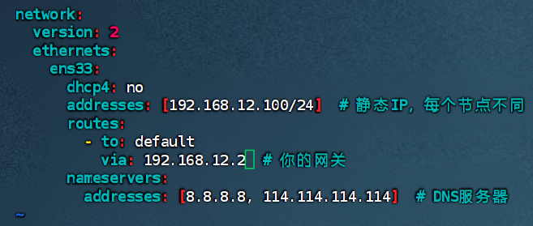
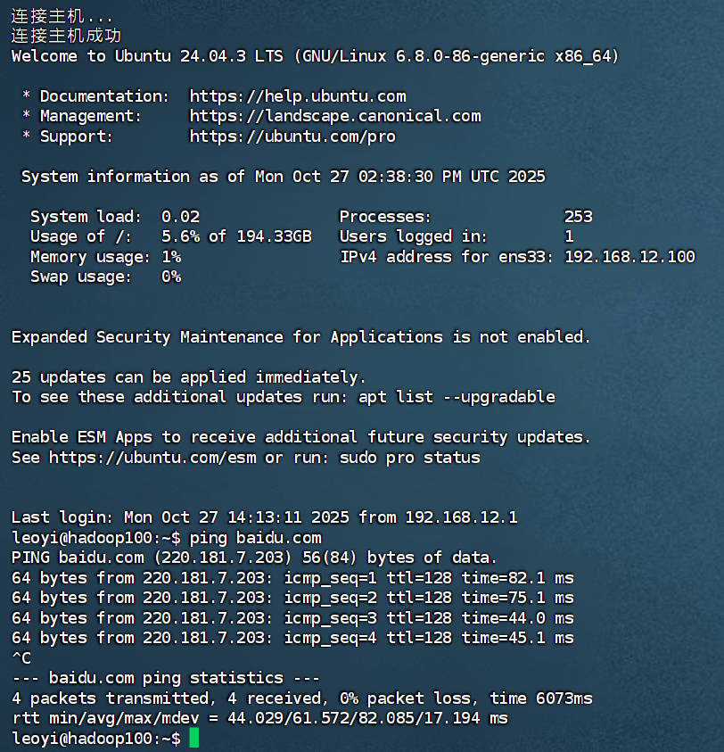
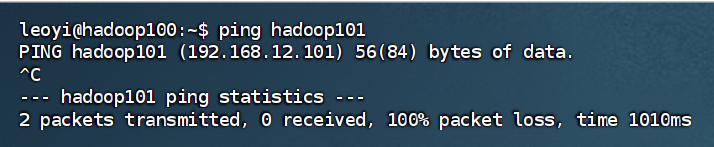
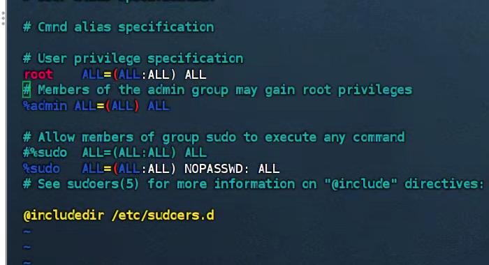
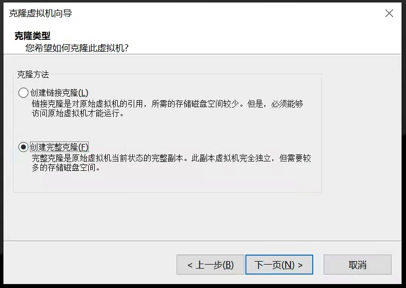
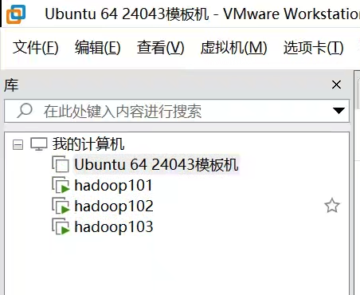

# VM虚拟机三节点构建过程

## 1、确认宿主机配置

CPU：8核16线程，即16个逻辑线程
内存：DDR5 48G *2 = 96G
硬盘：1TB+2TB SSD(NVMe)

## 2、节点资源分配

|节点|IP|CPU|内存|硬盘|用途|
|--|--|--|--|--|--|
|hadoop101|192.168.12.101|2处理器*2核心 = 4vCPU|24GB|200GB|主节点，Kafka、Flink JobManager、监控系统（Prometheus等）|
|hadoop102|192.168.12.102|2处理器*2核心 = 4vCPU|24GB|200GB|从节点，Flink TaskManager、Paimon、Doris BE|
|hadoop103|192.168.12.103|2处理器*2核心 = 4vCPU|24GB|200GB|从节点，MySQL、Doris FE、DataEase|

最后实际如下：
|节点|IP|CPU|内存|硬盘|用途|
|--|--|--|--|--|--|
|hadoop101|192.168.12.101|2处理器*2核心 = 4vCPU|24GB|200GB|NameNode、DataNode、NodeManager、Dinky、DorisFE、DorisBE|
|hadoop102|192.168.12.102|2处理器*2核心 = 4vCPU|24GB|200GB|DataNode、ResourceManager、NodeManager、DorisBE|
|hadoop103|192.168.12.103|2处理器*2核心 = 4vCPU|24GB|200GB|SecondaryNameNode、DataNode、NodeManager、DorisBE、MySQL(docker)|


## 3、确保开启虚拟化

在使用vmware分配虚拟机cpu资源时，确保所有节点核心数不超过宿主机逻辑线程数（可以等于，甚至超过，但最好不要）。
例如上述三个节点，每个节点分配2处理器，每处理器2核心，总计12个vCPU，小于宿主机16个逻辑线程。
同时，为了确保虚拟机性能，在分配虚拟机CPU时，一定要打开虚拟化引擎的设定：


如果vm提示此平台不支持虚拟化，可能是宿主机虚拟化CPU没有开启(没打开的话要去BIOS开启)，或者w11系统开启了虚拟化安全性保护（win+r运行msinfo32后可以看到是否开启基于虚拟化的安全性），需要关闭才可以使用vm的虚拟化。
按照如下脚本，使用管理员运行，运行完成后重启宿主机电脑，多按几次F3继续，成功开机后，虚拟化安全性保护将关闭，vm虚拟化将正常使用：
> 原教程:https://blog.51cto.com/wangguangjie/13480278
```sh
@echo off

dism /Online /Disable-Feature:microsoft-hyper-v-all /NoRestart
dism /Online /Disable-Feature:IsolatedUserMode /NoRestart
dism /Online /Disable-Feature:Microsoft-Hyper-V-Hypervisor /NoRestart
dism /Online /Disable-Feature:Microsoft-Hyper-V-Online /NoRestart
dism /Online /Disable-Feature:HypervisorPlatform /NoRestart

REM ===========================================

mountvol X: /s
copy %WINDIR%\System32\SecConfig.efi X:\EFI\Microsoft\Boot\SecConfig.efi /Y
bcdedit /create {0cb3b571-2f2e-4343-a879-d86a476d7215} /d "DebugTool" /application osloader
bcdedit /set {0cb3b571-2f2e-4343-a879-d86a476d7215} path "\EFI\Microsoft\Boot\SecConfig.efi"
bcdedit /set {bootmgr} bootsequence {0cb3b571-2f2e-4343-a879-d86a476d7215}
bcdedit /set {0cb3b571-2f2e-4343-a879-d86a476d7215} loadoptions DISABLE-LSA-ISO,DISABLE-VBS
bcdedit /set {0cb3b571-2f2e-4343-a879-d86a476d7215} device partition=X:
mountvol X: /d
bcdedit /set hypervisorlaunchtype off

echo.
echo.
echo.
echo.
echo =======================================================
echo 当前操作已完成，接下来请关闭此窗口并重启电脑，然后根据屏幕提示完成剩下操作。
pause > nul
echo.
echo.
```

## 4、网络配置

> 需要开启远程ssh连接，为了方便集群内节点之间的访问，每个节点还需要一个固定的主机名和ip，否则可能会导致集群不稳定，一旦某节点ip变化，集群可能就无法访问该节点。

### 4.1 开启ssh服务
```sh
安装ssh包：
sudo apt update
sudo apt install openssh-server openssh-client -y
管理ssh服务：
sudo systemctl start ssh     # 启动SSH服务
sudo systemctl stop ssh      # 停止SSH服务
sudo systemctl restart ssh   # 重启SSH服务
sudo systemctl status ssh   #检查SSH服务状态
配置防火墙允许ssh：
sudo ufw allow ssh
关闭防火墙（可选）
sudo ufw disable
```

### 4.2 固定VM虚拟机网段
将虚拟机分配到192.168.12.x网段，防止和宿主机网段（通常是192.168.1.x）冲突。
为了方便管理，配置网段从192.168.12.100开始，该IP给予模板机节点hadoop100。


点击NAT设置，可以看到网关是192.168.12.2：
> 宿主机在该网段的ip为192.168.12.1



### 4.3 固定主机名及固定ip
以模板机节点Hadoop100为例。
操作系统为Ubuntu Server 24.04.3 LTS。

#### 4.3.1 修改hostname
```sh
sudo hostnamectl set-hostname hadoop100
```

#### 4.3.2 设置固定IP

```sh
sudo vim /etc/netplan/50-cloud-init.yaml
```
输入指令后，可以看到：

修改为：


修改完成后`wq!`退出vim，随后输入下面指令使更改生效：
```sh
sudo netplan apply
```
此时hadoop100节点的hostname和固定IP都已设置完成，使用finalshell连接hadoop100，可以看到ip已生效，ping百度测试DNS成功连通。


### 4.4 配置主机名和IP之间的映射

模板机节点hadoop100的主机名和ip分别是hadoop100和192.168.12.100，而实际的三个工作节点分别如下：

|节点主机名|节点ip|
|--|--|
|hadoop101|192.168.12.101|
|hadoop102|192.168.12.102|
|hadoop103|192.168.12.103|

根据这个分配，修改`/etc/hosts`添加如下内容：
```sh
# Hadoop集群节点映射
# 模板节点
192.168.12.100 hadoop100
# 工作节点
192.168.12.101 hadoop101
192.168.12.102 hadoop102
192.168.12.103 hadoop103

```
保存后hosts文件会即刻生效，ping一下hadoop101主机名看看是否生效：

hadoop101主机名被解析为192.168.12.101，配置成功。
> 之后三节点创建成功后，可以成功ping通。

为了确保节点直接的ssh访问通常，直接关闭防火墙：
```sh
sudo ufw disable
```

### 4.5 配置SSH免密登录
#### 4.5.1 在所有节点生成密钥
在所有节点都执行：
```sh
ssh-keygen -t rsa -P "" -f ~/.ssh/id_rsa
```
### 4.5.2 在所有节点分发公钥
> 基于hadoop的设计，主节点运行start-dfs.sh将ssh到所有从节点启动DataNode，主节点运行start-yarn将ssh到所有从节点启动NodeManager，所以主节点到从节点的ssh免密登录是必要的，反过来则是可选的。
> 但考虑到flink和doris的设计，从节点需要访问主节点进行一些操作，所以需要配置完全的双向ssh免密登录。

在所有节点执行：
```sh
#拷贝本节点的公钥到其他节点的授权文件authorized_keys中，实现本节点到其他节点的免密ssh登录
ssh-copy-id hadoop101
ssh-copy-id hadoop102
ssh-copy-id hadoop103
```

### 4.6 安装可选工具包
本章节作为一个参考，相关工具包列在这里。

1、SSH相关包：
```sh
# 安装SSH服务器和客户端
sudo apt update
sudo apt install openssh-server openssh-client -y
# 启动SSH服务
sudo systemctl enable ssh
sudo systemctl start ssh
sudo systemctl status ssh
```
2、网络诊断工具
```sh
# 安装网络工具包
sudo apt install net-tools iputils-ping dnsutils -y
```
3、文件传输工具
```sh
# 安装SCP/SFTP等文件传输工具
sudo apt install rsync curl wget -y
```

## 5、权限配置
为了方便之后的操作，需要给使用的用户配置sudo权限，做法是将用户添加到sudo组。
```sh
sudo usermod -aG sudo leoyi
```
>sudo： 因为我们正在修改用户权限，所以需要先提权。
usermod： 修改用户属性的命令。
-aG： 这是两个选项的组合。
-a 代表 “append”（追加），非常重要！它确保将用户添加到新组的同时，不会移除他原来所属的其他组。
-G 后面指定要加入的组名。
sudo： 目标组名。
leoyi： 你要修改的用户名。

同时，为了后续执行脚本的方便，将sudo用户组设置为不需要密码验证。
> 默认情况下，sudo指令会要求验证密码。

执行`sudo vim /etc/sudoers`修改配置文件，如下图所示，将`%sudo  ALL=(ALL:ALL) ALL`修改为`sudo   ALL=(ALL:ALL) NOPASSWD: ALL`，保存并退出。
> 注意这是危险操作，最好保存一个快照再操作，或者使用sudo visudo

```sh
# User privilege specification
root    ALL=(ALL:ALL) ALL
# Members of the admin group may gain root privileges
%admin ALL=(ALL) ALL

# Allow members of group sudo to execute any command
#%sudo  ALL=(ALL:ALL) ALL
%sudo   ALL=(ALL:ALL) NOPASSWD: ALL

```


 <p style="color:red;font-size:1.4em" >至此，模板节点准备完毕。</p>


## 6、从模板节点创建三节点
为了构建完整的hadoop集群，使用vmware**完整克隆**hadoop100节点获得三个新节点hadoop101、hadoop102、hadoop103。

- 链接克隆：以原模板虚拟机的制定快照为父磁盘，链接克隆虚拟机只拥有很小的差异磁盘，读操作根据需要从父磁盘或差异磁盘读取。该方式适合短期的测试，比如创建50个临时的测试节点，而不会占用很大的磁盘空间。
- 完整克隆：顾名思义，以深拷贝的方式创建一个新的独立虚拟机。以长期稳定运行为目的的节点必须采用这种方式。


> 在模板节点的基础上，还需要调整三节点的主机名和固定ip，调整方式同4.3和4.4小节。
