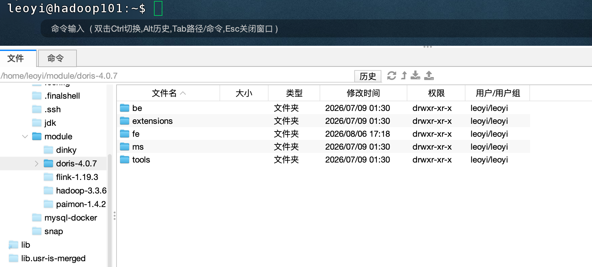

# vm集群部署doris

> 考虑到我的本地学习环境（三台vm虚拟机，每台24GB内存，200GB存储，还要运行hadoop集群，dinky,docker/mysql等），采用1FE+3BE的方式部署doris集群，版本为4.0.7LTS。


## 1、前期准备

### （1）集群规划
| 节点 | 运行组件 | 内存预算 | 说明 |
|---|---|---|---|
| hadoop101 | FE（唯一）+ BE | FE 4G + BE 6G | 额外运行 NameNode、DataNode、NodeManager、HistoryServer、Dinky、Docker+MySQL |
| hadoop102 | BE | BE 6G | 额外运行 DataNode、NodeManager、ResourceManager |
| hadoop103 | BE | BE 6G | 额外运行 DataNode、NodeManager、SecondaryNameNode|

### （2）端口检查
Doris 端口使用：

FE：8030（HTTP）、9030（MySQL）、9010（RPC，只用于FE通信，这里不用）
BE：9060（be_port）、8040（webserver）、9050（心跳）、8060（brpc）
检查端口冲突：ss -tlnp | grep -E ':(8030|9030|9010|9060|8040|9050|8060)\b'，若有占用请先处理。

### （3）关闭防火墙
三台机器都运行：
```sh
sudo ufw disable
sudo swapoff -a
sudo sed -i '/swap/s/^/#/' /etc/fstab
```

### (4)调整系统限制
三台机器都运行：
```sh
sudo bash -c 'cat >> /etc/security/limits.conf << EOF
* soft nofile 655360
* hard nofile 655360
* soft nproc 655360
* hard nproc 655360
EOF'

echo 'vm.max_map_count=2000000' | sudo tee -a /etc/sysctl.conf
sudo sysctl -p
```
重新登录(reboot)，然后执行 ulimit -n 确认输出 655360。

### (5)安装jdk17
doris4.0.7使用jdk17，三台机器上目前都准备了jdk，对应的java_home都为`JAVA_HOME=/home/leoyi/jdk/jdk-17.0.10+7`

### （6）确认主机之间互通
hadoop101上执行以下指令，确认主机之间互通：
```sh
ping -c 1 hadoop102; ping -c 1 hadoop103
```

### （7）下载doris安装包
选择doris 4.0.7 lts版本的x64(avx2)二进制包。
下载页为:[点击打开](https://doris.apache.org/download/)
文件名为:`apache-doris-4.0.7-bin-x64.tar.gz`
下载到三台机器的`~/module`目录下，运行`tar -zxvf apache-doris-4.0.7-bin-x64.tar.gz`解压安装包，随后重命名目录，得到`/home/leoyi/module/doris-4.0.7`


## 2、部署前端

### （1）创建元数据目录
运行下面指令创建目录：
`mkdir -p /home/leoyi/module/doris-4.0.7/fe/doris-meta`
> doris 4.0.7版本，该目录默认存在

### （2） 修改fe.conf
修改`/home/leoyi/module/doris-4.0.7/fe/conf/fe.conf`
添加如下配置行：
```sh
meta_dir = /home/leoyi/module/doris-4.0.7/fe/doris-meta
JAVA_HOME=/home/leoyi/jdk/jdk-17.0.10+7
priority_networks = 192.168.12.0/24
JAVA_OPTS = "-Xmx4096m -Xms4096m -XX:+UseG1GC -XX:+HeapDumpOnOutOfMemoryError -Dfile.encoding=UTF-8"
```
### （3）启动fe
```sh
cd /home/leoyi/module/doris-4.0.7/fe/bin
./start_fe.sh --daemon
```
> 停止fe脚本是`./stop_fe.sh`

### （4）验证
```sh
# 查看日志（无致命错误即可）
tail -100 /home/leoyi/module/doris-4.0.7/fe/log/fe.log
# 使用 mysql 客户端连接（需先安装 mysql client，如未装可 sudo apt install mysql-client）
mysql -h hadoop101 -P 9030 -uroot
```
进入mysql后，输入：
```sql
SHOW FRONTENDS;
```
应看到一行记录，IsMaster 为 true，Alive 为 true，说明fe启动成功。

## 3、部署后端

### （1）创建存储目录
运行下面指令创建目录：
```sh
mkdir -p /home/leoyi/module/doris-4.0.7/be/storage
```
> doris 4.0.7版本，该目录默认存在

### （2）修改 be.conf
修改`/home/leoyi/module/doris-4.0.7/be/conf/be.conf`
添加如下配置行：
```sh
JAVA_HOME=/home/leoyi/jdk/jdk-17.0.10+7
webserver_port = 18040 # 8040被hadoop集群占用了
priority_networks = 192.168.12.0/24
storage_root_path = /home/leoyi/module/doris-4.0.7/be/storage
em_limit = 6G
```

### （3）启动be
```sh
cd /home/leoyi/module/doris-4.0.7/be/bin
./start_be.sh --daemon
```
> 停止be脚本是`./stop_be.sh`

### （4）注册 BE 到 FE（在 hadoop101 上连接 FE 执行）
```sh
mysql -h hadoop101 -P 9030 -uroot
```
执行：
```sql
ALTER SYSTEM ADD BACKEND "hadoop101:9050";
ALTER SYSTEM ADD BACKEND "hadoop102:9050";
ALTER SYSTEM ADD BACKEND "hadoop103:9050";
```
验证：
```sql
SHOW BACKENDS;
```
三个后端都应为 Alive=true，说明be节点都启动成功了。

### （5）修改root/admin密码（在 hadoop101 上连接 FE 执行）
```sh
mysql -h hadoop101 -P 9030 -uroot
```
执行：
```sql
SET PASSWORD FOR 'root' = PASSWORD('doris@1998');
SET PASSWORD FOR 'admin' = PASSWORD('doris@1998');
```
验证:
```sql
mysql -h hadoop101 -P 9030 -uroot -p'doris@1998'
```
