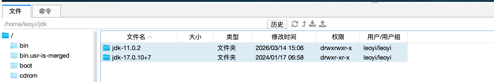
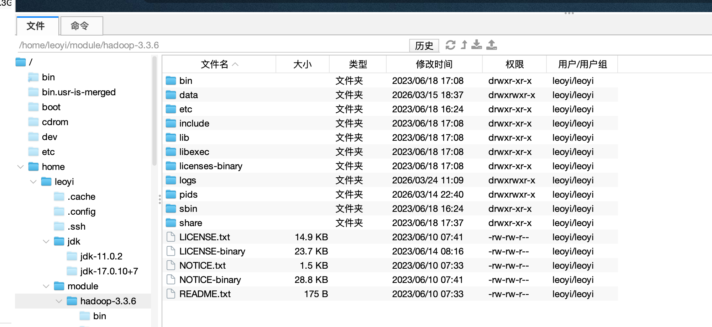
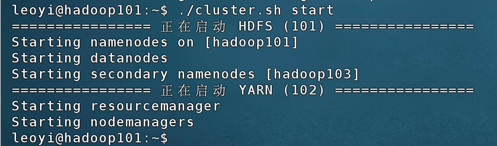
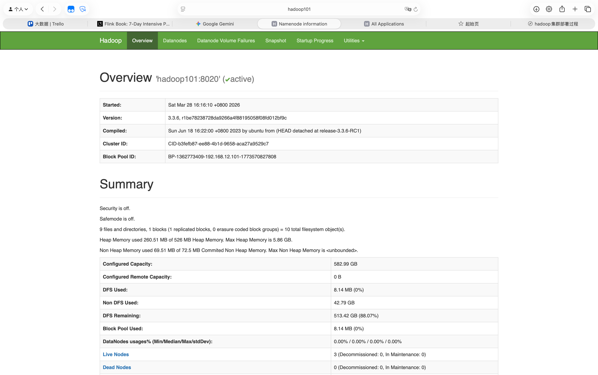
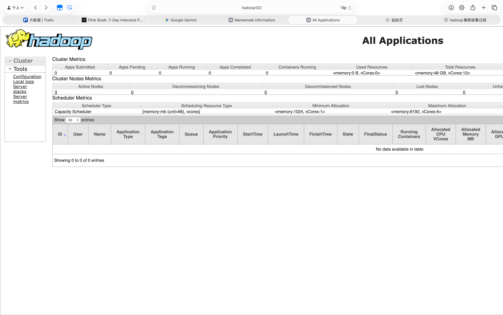

# Hadoop集群部署过程

> hadoop集群不适合部署在docker swarm集群上，swarm内部的网络问题很容易导致hadoop集群中节点之间的双向访问受阻，因此最好在宿主机上部署hadoop集群。

> 工作概述
> 1. 准备jdk
> 2. 准备hadoop包
> 3. 部署hadoop
>   a. 配置hadoop-env.sh，配置core-site.xml、hdfs-site.xml、yarn-site.xml文件
>   b. ～/.bashrc中配置hadoop_home等
> 4. 验证安装

## 1.1 集群规划
主要是规划 HDFS 和 YARN 的节点：
- 对于 HDFS，NameNode 和 SecondNameNode比较耗资源，不要放在同一个节点上，从容灾来讲，也不推荐放在一个节点上。
- 对于 YARN，ResourceManager比较耗资源，不推荐和 HDFS 的NN 和 2NN放在一个节点上。

||hadoop101|hadoop102|hadoop103|
|---|---|---|---|
|HDFS|DataNode、NameNode|DataNode|DataNode、SecondNameNode|
|YARN|NodeManager|NodeManager、ResourceManager|NodeManager|

## 1.2 准备JDK和环境变量
由于后续使用jdk11部署hadoop3.3.6，使用jdk17部署flink1.19，所以jdk必须分开，且不能导入到全局环境变量中。
因此，先将jdk统一下载到一个固定目录，比如`~/jdk/`下，然后在`~`下或其他目录比如`/usr/local/bin`下新建若干个sh脚本用于切换环境。

- 如图所示，将jdk11和jdk17下载并解压到`~/jdk/`下，并且运行`rsync`将jdk11和jdk17同步到三个节点上。
  

- 准备好`go-hadoop.sh`和`go-flink.sh`脚本，需要的时候直接`source go-xxx.sh`脚本就可以直接临时切换环境。

- `go-hadoop.sh`：
    ```sh
    export JAVA_HOME=/home/leoyi/jdk/jdk-11.0.2
    export HADOOP_HOME=/home/leoyi/module/hadoop-3.3.6
    export PATH=$JAVA_HOME/bin:$HADOOP_HOME/bin:$HADOOP_HOME/sbin:$PATH
    ```

- `go-flink.sh`:
    ```sh
    export JAVA_HOME=/home/leoyi/jdk/jdk-17.0.10+7
    export FLINK_HOME=/home/leoyi/module/flink-1.19
    export PATH=$JAVA_HOME/bin:$FLINK_HOME/bin:$PATH
    ```

## 1.3 准备hadoop文件
- 下载并解压hadoop3.3.6文件包，并解压到hadoop101的`~/module/`目录下，并使用以下脚本同步到hadoop102、hadoop103节点上。
  
```sh
rsync -av /home/leoyi/module/hadoop-3.3.6 leoyi@hadoop102:/home/leoyi/module/
rsync -av /home/leoyi/module/hadoop-3.3.6 leoyi@hadoop103:/home/leoyi/module/
```


## 1.4 准备hadoop配置文件
- hadoop配置文件都在`etc/hadoop/`下，需要修改的核心配置文件有以下五个：
  - `core-site.xml`：是hadoop的全局配置，决定了集群最基础的运行环境，定义元数据节点（namenode）的地址，以及hadoop运行时数据的临时存储目录。
  - `hdfs-site.xml`：决定HDFS系统的具体参数，例如副本数量和2NN的运行节点。
  - `yarn-site.xml`：决定YARN系统的运行规则，如果只使用flink on yarn的话，没有mapreduce任务的话，只配RM的运行节点就行。
  - `works`：配置工作节点，写在这个文件的主机名都作为worker（datanode和nodemanager）。
  - `hadoop-env.sh`：配置hadoop的运行环境变量，由于不配置全局的jdk环境变量，在这里要显式指定JDK路径。

- `core-site.xml`：
    ```xml
    <configuration>
        <property>
            <name>fs.defaultFS</name>
            <value>hdfs://hadoop101:8020</value>
        </property>
        <property>
            <name>hadoop.tmp.dir</name>
            <value>/home/leoyi/module/hadoop-3.3.6/data</value>
        </property>
        <property>
            <name>hadoop.http.staticuser.user</name>
            <value>leoyi</value>
        </property>
        <property>
            <name>fs.trash.interval</name>
            <value>1440</value>
        </property>
        <property>
            <name>fs.trash.checkpoint.interval</name>
            <value>60</value>
        </property>
    </configuration>
    ```
- `hdfs-site.xml`:
    ```xml
    <configuration>
        <property>
            <name>dfs.replication</name>
            <value>3</value>
        </property>
        <property>
            <name>dfs.namenode.secondary.http-address</name>
            <value>hadoop103:9868</value>
        </property>
    </configuration>
    ```
- `yarn-site.xml`:
    ```xml
    <configuration>
        <property>
            <name>yarn.resourcemanager.hostname</name>
            <value>hadoop102</value>
        </property>
        <property>
            <name>yarn.nodemanager.env-whitelist</name>
            <value>JAVA_HOME,HADOOP_COMMON_HOME,HADOOP_HDFS_HOME,HADOOP_CONF_DIR,CLASSPATH_PREPEND_DISTCACHE,HADOOP_YARN_HOME,HADOOP_MAPRED_HOME</value>
        </property>
        <property>
            <name>yarn.resourcemanager.webapp.address</name>
            <value>0.0.0.0:8088</value>
        </property>
        <property>
            <name>yarn.log-aggregation-enable</name>
            <value>true</value>
        </property>
        <property>
            <name>yarn.log-aggregation.retain-seconds</name>
            <value>604800</value> 
        </property>
        <property>
            <name>yarn.nodemanager.resource.memory-mb</name>
            <value>16384</value>
        </property>
        <property>
            <name>yarn.nodemanager.resource.cpu-vcores</name>
            <value>4</value>
        </property>
        <property>
            <name>yarn.nodemanager.vmem-check-enabled</name>
            <value>false</value>
        </property>
    </configuration>
    ```
- `hadoop-env.sh`:
    ```sh
    # 显式指定 JDK 路径
    export JAVA_HOME=/home/leoyi/jdk/jdk-11.0.2
    # 预防 HADOOP 找不到自身安装路径
    export HADOOP_HOME=/home/leoyi/module/hadoop-3.3.6
    ```

- `works`:
    ```txt
    hadoop101
    hadoop102
    hadoop103
    ```


## 1.5 准备一键启停部署脚本
启动一个完整的hadoop集群，要先去NN节点启动hdfs集群，然后去RM节点启动yarn集群，停止集群时，要先去RM节点关闭yarn集群，然后去NN节点关闭hdfs集群，所以准备一个一键启停脚本更为方便：

- cluster.sh
    ```sh
    #!/bin/bash

    # 定义 Hadoop 路径（绝对路径最稳妥）
    HADOOP_BIN=/home/leoyi/module/hadoop-3.3.6/bin
    HADOOP_SBIN=/home/leoyi/module/hadoop-3.3.6/sbin
    # 定义加载环境的命令（假设你的脚本路径固定）
    LOAD_ENV="source /home/leoyi/go-hadoop.sh"

    case $1 in
    "start")
        echo "================ 正在启动 HDFS (101) ================"
        # 在 101 本地启动，通过 bash -c 强制加载环境
        bash -c "$LOAD_ENV && $HADOOP_SBIN/start-dfs.sh"

        echo "================ 正在启动 YARN (102) ================"
        # 远程登录到 102，并在远程 Shell 中先加载环境再启动
        ssh hadoop102 "$LOAD_ENV && $HADOOP_SBIN/start-yarn.sh"
        ;;
    "stop")
        echo "================ 正在停止 YARN (102) ================"
        ssh hadoop102 "$LOAD_ENV && $HADOOP_SBIN/stop-yarn.sh"

        echo "================ 正在停止 HDFS (101) ================"
        bash -c "$LOAD_ENV && $HADOOP_SBIN/stop-dfs.sh"
        ;;
    "status")
        for host in hadoop101 hadoop102 hadoop103
        do
            echo "---------------- $host JPS 状态 ----------------"
            ssh $host "$LOAD_ENV && jps" | grep -v Jps
        done
        ;;
    *)
        echo "使用方法: cluster.sh [start|stop|status]"
        ;;
    esac
    ```

## 1.6 启停集群
通过1.5的脚本，直接运行以下命令，就可以启动集群了，停止集群同理。
- 启动集群：
    ```sh
    ./cluster.sh start
    ```
    

然后就可以去macos上的浏览器看hdfs和yarn集群状态了。

