# 实验结果记录

## 实验目录
| # | 实验 | 归属规模 | 类型 | 
|---|---|---|---|
| 1 | CDC Changelog → Paimon Upsert 语义 | 100 万 | 正确性 |
| 2 | 架构选型 —— MySQL Flink CDC与Debezium CDC对比 | 100 万 | 正确性+选型 |
| 3 | GMV统计口径对比 | 100 万 | 建模 | 
| 4 | Paimon 分区裁剪（Partition Pruning） | 100 万 → 1000 万 | 性能 | 
| 5 | Paimon Bucket数量设置 | 1000 万 | 性能 | 
| 6 | Doris 分区裁剪 + Runtime Filter | 1000 万 | 性能 |
| 7 | Doris Colocate Join vs Shuffle Join | 1000 万 | 性能 | 
| 8 | Doris 物化视图 / 预聚合 | 1000 万 | 性能 | P1 |
---
## 实验记录

### 实验1、CDC Changelog → Paimon Upsert 语义

**目的**
- 验证"同一主键的多次 UPDATE 在 deduplicate模式Paimon主键表里只留最新一行"。


**实验说明**：

| 项 | 值 |
|---|---|
| 数据规模 | 100 万订单 |
| 操作方法 | 指定商品id，读取MySQL CDC ChangeLog|
| 观测对象 | Flink流作业的ChangeLog，以及MySQL和Paimon ODS表的最终状态 |

<details>
<summary><strong>SQL代码(点击展开)</strong></summary>

```sql
-- dinky上运行作业，打印流
SET 'execution.runtime-mode' = 'streaming';
CREATE TEMPORARY TABLE cdc_dim_product (
  product_id   BIGINT,
  product_name VARCHAR(128),
  category     VARCHAR(32),
  brand        VARCHAR(64),
  price        DECIMAL(10,2),
  cost_price   DECIMAL(10,2),
  stock        INT,
  status       TINYINT,
  is_deleted   TINYINT,
  deleted_time TIMESTAMP(3),
  create_time  TIMESTAMP(3),
  update_time  TIMESTAMP(3),
  PRIMARY KEY (product_id) NOT ENFORCED
) WITH (
  'connector'                = 'mysql-cdc',
  'hostname'                 = 'hadoop103',
  'port'                     = '3307',
  'username'                 = 'root',
  'password'                 = '123456',
  'database-name'            = 'eshop_1m',
  'table-name'               = 'dim_product',
  'scan.startup.mode'        = 'earliest-offset',
  'scan.incremental.snapshot.enabled' = 'true',
  'server-id'                = '5401',
  'server-time-zone'         = 'Asia/Shanghai',
  'debezium.snapshot.mode'   = 'initial',
  'connect.timeout'          = '30s',
  'connect.max-retries'      = '5'
);


select 
product_id,price,update_time
from cdc_dim_product
where product_id =1;

```

```sql
-- 观察mysql和paimon ods表的最终状态
-- 在MySQL中：
select product_id,price,update_time
from dim_product 
where product_id =1

-- 在Paimon ODS中:
select product_id,price,update_time
from paimon_eshop_1m.ods.dim_product 
where product_id =1
```
</details>

<details>
<summary><strong>实验过程记录(点击展开)</strong></summary>

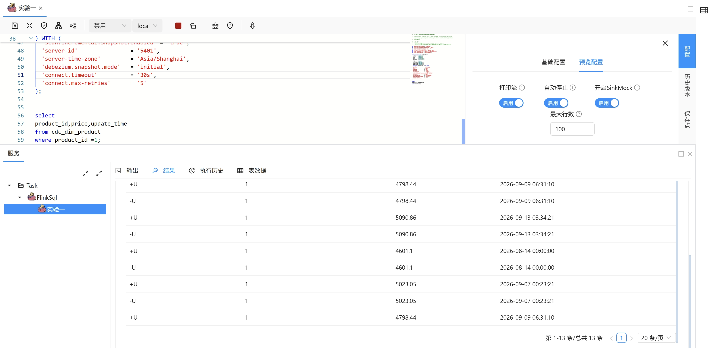

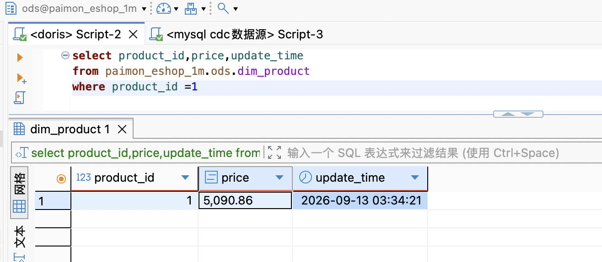

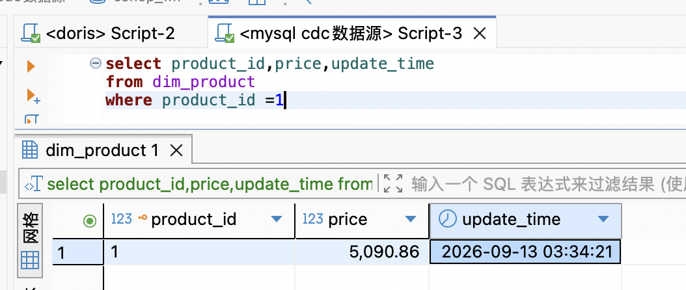

</details>


**结果记录**
| 事件 | MySQL 侧发生数 | Flink changelog 行数 |
|---|---:|:---:|
| INSERT（新增商品） |一次 | `+I`一条 | 
| UPDATE（商品调价） |六次| `-U/+U` 各6条 |

- MySQL和Paimon中，product_id=1时，最终价格都是

**实验结论**
- 对于Deduplicate模式Paimon主键表，能完整消费上游Upsert流，正确处理ChangeLog，和源表保持同样的最终状态。
---
### 实验2、架构选型 —— MySQL Flink CDC与Debezium CDC对比

**目的**
- 对比Flink CDC和Debezium CDC的区别。

**实验说明**:
| 项 | 值 |
|---|---|
|数据规模|2000条/秒，五分钟共60万条增量数据|
|对照组|A链路Flink CDC ； B链路Debezium CDC|
|操作方法|分别进行实验。A链路开启CDC作业后，开始产生增量数据。B链路先创建debezium连接器和CDC作业后，开始产生增量数据。|


<details>
<summary><strong>SQL代码与Debzium连接器配置（点击展开）</strong></summary>

```sql

-- mysql数据库建测试表
CREATE TABLE IF NOT EXISTS cdc_test (
    id             BIGINT UNSIGNED NOT NULL AUTO_INCREMENT,
    create_time_ms BIGINT NOT NULL
                   COMMENT '写入时刻 epoch 毫秒（真实墙钟）★ 延迟锚点 ★',
    create_time    DATETIME(3) NOT NULL
                   COMMENT '同上时刻的可读形式（+08:00 墙钟），仅核对用',
    source_time    DATETIME(3) DEFAULT NULL
                   COMMENT 'binlog 事件时间(秒级精度)；MySQL 侧恒为 NULL，由 CDC 填入',
    sink_time      DATETIME(3) DEFAULT NULL
                   COMMENT 'Flink 写入 Paimon 时刻；MySQL 侧恒为 NULL，由 Flink 填入',
    PRIMARY KEY (id),
    KEY idx_create_time (create_time)
) ENGINE=InnoDB DEFAULT CHARSET=utf8mb4
  COMMENT='实验2 CDC 端到端延迟/吞吐 基准表';
```

```sql
-- Paimon ODS建表
CREATE TABLE cdc_test (
  id             BIGINT       COMMENT '自增id（同时用于区分两次run）',
  create_time_ms BIGINT       COMMENT '写入时刻 epoch 毫秒 ★延迟锚点★',
  create_time    TIMESTAMP(3) COMMENT '同上时刻（由 create_time_ms 派生，两条链路一致）',
  source_time    TIMESTAMP(3) COMMENT 'binlog 事件时间（秒级精度，仅旁证）',
  sink_time      TIMESTAMP(3) COMMENT 'Flink 写入本表时刻',
  PRIMARY KEY (id) NOT ENFORCED
) WITH (
  'bucket'       = '2',
  'merge-engine' = 'deduplicate',
  'file.format'  = 'avro',
  'sink.parallelism' = '1'
);
```

```sql
-- Flink CDC
SET 'table.local-time-zone' = 'Asia/Shanghai';
SET 'execution.checkpointing.interval' = '10s';
SET 'table.exec.sink.upsert-materialize' = 'NONE';
CREATE CATALOG paimon_eshop_1m WITH (
  'type'      = 'paimon',
  'warehouse' = 'hdfs:///paimon/warehouse/eshop_1m'
);

CREATE TEMPORARY TABLE cdc_test_src (
  id             BIGINT,
  create_time_ms BIGINT,
  op_ts          TIMESTAMP_LTZ(3) METADATA FROM 'op_ts' VIRTUAL,
  PRIMARY KEY (id) NOT ENFORCED
) WITH (
  'connector'                          = 'mysql-cdc',
  'hostname'                           = 'hadoop103',
  'port'                               = '3307',
  'username'                           = 'root',
  'password'                           = '123456',
  'database-name'                      = 'eshop_1m',
  'table-name'                         = 'cdc_test',
  'scan.startup.mode'                  = 'latest-offset',
  'scan.incremental.snapshot.enabled'  = 'true',
  'server-id'                          = '5410',
  'server-time-zone'                   = 'Asia/Shanghai',
  'connect.timeout'                    = '30s',
  'connect.max-retries'                = '5'
);

INSERT INTO paimon_eshop_1m.ods.cdc_test
SELECT id,
       create_time_ms,
       CAST(TO_TIMESTAMP_LTZ(create_time_ms, 3) AS TIMESTAMP(3)) AS create_time,
       CAST(op_ts AS TIMESTAMP(3))                              AS source_time,
       CAST(CURRENT_TIMESTAMP AS TIMESTAMP(3))                  AS sink_time
FROM cdc_test_src;

```

```sql
-- debezium cdc
SET 'table.local-time-zone' = 'Asia/Shanghai';
SET 'execution.checkpointing.interval' = '10s';
SET 'table.exec.sink.upsert-materialize' = 'NONE';
CREATE CATALOG paimon_eshop_1m WITH (
  'type'      = 'paimon',
  'warehouse' = 'hdfs:///paimon/warehouse/eshop_1m'
);


CREATE TEMPORARY TABLE cdc_test_kafka (
  `after`  ROW<`id` BIGINT, `create_time_ms` BIGINT>,
  `source` ROW<`ts_ms` BIGINT>,
  `op`     STRING
) WITH (
  'connector'                     = 'kafka',
  'topic'                         = 'eshop.eshop_1m.cdc_test',
  'properties.bootstrap.servers'  = 'hadoop101:9092,hadoop102:9092,hadoop103:9092',
  'properties.group.id'           = 'eshop-exp2-debezium',
  'scan.startup.mode'             = 'latest-offset',
  'scan.topic-partition-discovery.interval' = '30s',
  'format'                        = 'json',
  'json.ignore-parse-errors'      = 'true',
  'json.fail-on-missing-field'    = 'false'
);

INSERT INTO paimon_eshop_1m.ods.cdc_test
SELECT `after`.`id`,
       `after`.`create_time_ms`,
       CAST(TO_TIMESTAMP_LTZ(`after`.`create_time_ms`, 3) AS TIMESTAMP(3)) AS create_time,
       CAST(TO_TIMESTAMP_LTZ(`source`.`ts_ms`, 3)          AS TIMESTAMP(3)) AS source_time,
       CAST(CURRENT_TIMESTAMP AS TIMESTAMP(3))                              AS sink_time
FROM cdc_test_kafka
WHERE `op` = 'c';   
```

```sql
-- 延迟分析SQL
SET 'execution.runtime-mode' = 'batch';

CREATE CATALOG paimon_eshop_1m WITH (
  'type'      = 'paimon',
  'warehouse' = 'hdfs:///paimon/warehouse/eshop_1m'
);
USE CATALOG paimon_eshop_1m;
USE ods;

SELECT '链路A Flink CDC' AS run_name,
       COUNT(*)                                                   AS rows_cnt,
       MIN(create_time)                                           AS first_write,
       MAX(sink_time)                                             AS last_arrival,
       TIMESTAMPDIFF(SECOND, MIN(create_time), MAX(sink_time))     AS elapsed_sec,
       ROUND(COUNT(*) / TIMESTAMPDIFF(SECOND, MIN(create_time), MAX(sink_time)), 1)
                                                                  AS avg_rows_per_sec
FROM ods.cdc_test
WHERE id BETWEEN 1 AND 600000
  AND sink_time IS NOT NULL;


SELECT COUNT(*) AS n,
       MAX(CASE WHEN rn <= n * 0.50 THEN latency_ms END) AS p50_ms,
       MAX(CASE WHEN rn <= n * 0.95 THEN latency_ms END) AS p95_ms,
       MAX(CASE WHEN rn <= n * 0.99 THEN latency_ms END) AS p99_ms,
       MIN(latency_ms)  AS min_ms,   -- ★ 若为负数，说明存在时钟偏差
       MAX(latency_ms)  AS max_ms,
       AVG(latency_ms)  AS avg_ms
FROM (
  SELECT latency_ms,
         ROW_NUMBER() OVER (ORDER BY latency_ms) AS rn,
         COUNT(*)     OVER ()                    AS n
  FROM (
    SELECT
      (EXTRACT(EPOCH       FROM sink_time) - EXTRACT(EPOCH       FROM create_time)) * 1000
    + (EXTRACT(MILLISECOND FROM sink_time) - EXTRACT(MILLISECOND FROM create_time))
      AS latency_ms
    FROM ods.cdc_test
    WHERE id BETWEEN 1 AND 600000
      AND create_time IS NOT NULL
      AND sink_time   IS NOT NULL
  ) l
) t;


```

```json
// debezium连接器配置
{
    "connector.class": "io.debezium.connector.mysql.MySqlConnector",
    "tasks.max": "1",
    "database.hostname": "hadoop103",
    "database.port": "3307",
    "database.user": "root",
    "database.password": "123456",

    "database.server.id": "184055",

    "database.include.list": "eshop_1m",
    "table.include.list": "eshop_1m.cdc_test",

    "topic.prefix": "eshop",

    "snapshot.mode": "no_data",

    "schema.history.internal": "io.debezium.storage.kafka.history.KafkaSchemaHistory",
    "schema.history.internal.kafka.bootstrap.servers": "hadoop101:9092,hadoop102:9092,hadoop103:9092",
    "schema.history.internal.kafka.topic": "schema-history.mysql-cdc-test",

    "schema.history.internal.store.only.captured.tables.ddl": "true",
    "schema.history.internal.store.only.captured.databases.ddl": "true",

    "key.converter": "org.apache.kafka.connect.storage.StringConverter",
    "value.converter": "org.apache.kafka.connect.json.JsonConverter",
    "value.converter.schemas.enable": "true",

    "decimal.handling.mode": "string",

    "errors.log.enable": "true",
    "errors.log.include.messages": "true",

    "producer.override.compression.type": "zstd"
  }
```

</details>


<details>
<summary><strong>实验过程记录 (点击展开)</strong></summary>

flink cdc吞吐计算
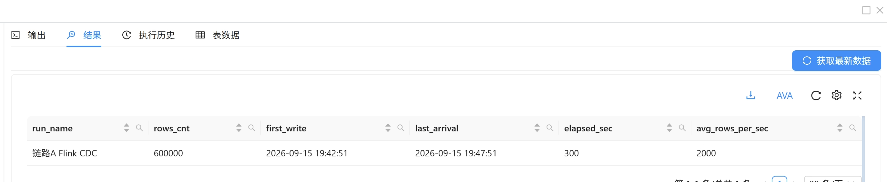

flink cdc延迟计算
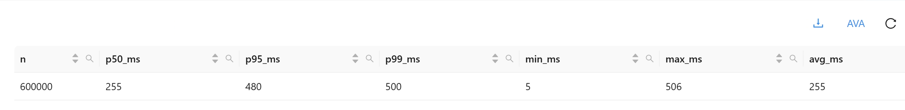

kafka集群：
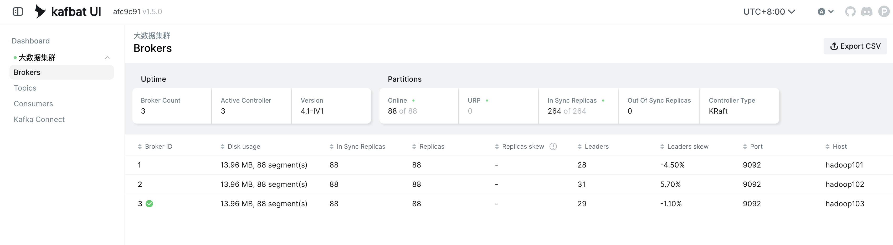

debezium连接器：
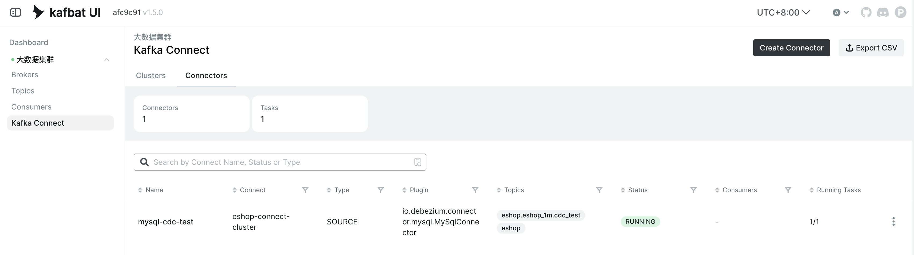

debezium连接器捕获mysql binlog数据：
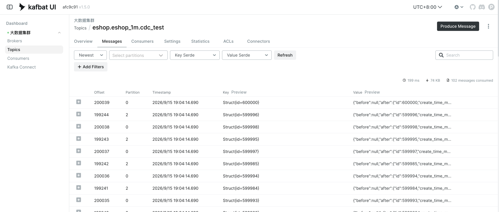

debezium cdc吞吐计算：
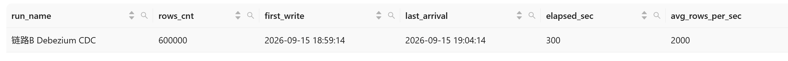

debezium cdc延迟计算：
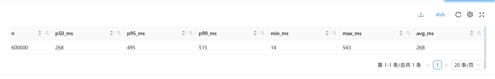

</details>


**结果记录**
| 指标 | A、Flink CDC | B、Debezium CDC | 
|---|---:|---:|
| 端到端延迟 P50/P95/P99 | 255/480/500ms| 268/495/515ms| 
|端到端延迟 min/max/avg|5/506/255ms|14/543/268ms|
| 实际吞吐（rows/s） | 2000行/秒|2000行/秒 |  
| 可回放能力 | 需重跑快照 | 从 offset 重放 | 


**实验结论**
- 两种模式差距不大，flink cdc底层同样基于debezium引擎，B链路相较于A链路多了一个环节（kafka），增加了一定的网络延迟，整体架构选型应综合考量技术栈兼容性、网络环境，以及运维成本。
- 例如：对于Oracle做CDC，Flink CDC模式兼容性不好，选择Debezium CDC模式，但性能受限于Oracle LogMiner单线程，最佳解决方式是Oracle GolenGate for BigData做CDC，数据走OGG->Kafka->Flink。


---
### 实验3、GMV统计口径对比

**目的**
- 对比使用SCD1商品维表、SCD2商品维表，以及事实表价格快照三种口径下的GMV计算值。

**实验说明**:
| 项 | 值 |
|---|---|
|数据规模|100万条订单|
|对照组|口径A：SCD1商品维表。口径B：SCD2商品维表。口径C：事实表价格快照|
|实验方法|使用Doris的联邦查询直接查询Paimon DWD层数据|


<details>
<summary><strong>统计SQL（点击展开）</strong></summary>

```sql
-- 口径A和C
SELECT 
  SUM(i.subtotal) AS gmv_snapshot,
  SUM(i.quantity * p.price) AS gmv_current_price,
  ROUND((SUM(i.quantity * p.price) - SUM(i.subtotal)) / SUM(i.subtotal) * 100, 2) AS diff_pct
FROM paimon_eshop_1m.dwd.fact_order_item i 
JOIN paimon_eshop_1m.dwd.dim_product p on i.product_id = p.product_id
```

```sql
-- 口径B
SELECT
  CAST(SUM(i.quantity * s.price) AS DECIMAL(18,2))   AS gmv_SCD2
FROM paimon_eshop_1m.dwd.fact_order_item i
LEFT JOIN paimon_eshop_1m.dwd.dim_product_price_scd2 s
       ON i.product_id = s.product_id
      AND i.create_time >= s.price_start_time
      AND i.create_time <  s.price_end_time;

```

```sql
-- 下钻品类、价格行分叉、以及TOP20单品分析GMV口径差异
SELECT 
  p.category ,
  SUM(i.subtotal) AS gmv_snapshot,
  SUM(i.quantity * p.price) AS gmv_current_price,
  ROUND((SUM(i.quantity * p.price) - SUM(i.subtotal)) / SUM(i.subtotal) * 100, 2) AS diff_pct
FROM paimon_eshop_1m.dwd.fact_order_item i 
JOIN paimon_eshop_1m.dwd.dim_product p on i.product_id = p.product_id
group by p.category

SELECT COUNT(*)                                                              AS 明细总行数,
       SUM(CASE WHEN ABS(i.unit_price - p.price) > 0.01 THEN 1 ELSE 0 END)   AS 分叉行数,
       ROUND(SUM(CASE WHEN ABS(i.unit_price - p.price) > 0.01 THEN 1 ELSE 0 END)
             * 100.0 / COUNT(*), 4)                                          AS 分叉率_pct,
       ROUND(AVG(ABS(i.unit_price - p.price)), 4)                            AS 行级平均绝对差
FROM paimon_eshop_1m.dwd.fact_order_item i 
JOIN paimon_eshop_1m.dwd.dim_product p ON i.product_id = p.product_id;


SELECT
  t.product_id                                              AS 商品ID,
  t.product_name                                            AS 商品名,
  t.category                                                AS 品类,
  t.current_price                                           AS 当前价,
  t.snapshot_price_min                                      AS 快照价_最低,
  t.snapshot_price_max                                      AS 快照价_最高,
  t.snapshot_price_cnt                                      AS 出现过几个价,
  t.avg_abs_diff                                            AS 平均绝对偏差,
  t.order_cnt                                               AS 影响订单数,
  t.gmv_snapshot                                            AS 快照GMV,
  t.gmv_current_price                                       AS 当前价GMV,
  t.gmv_bias                                                AS 影响GMV,
  t.gmv_bias_pct                                            AS 影响GMV_pct
FROM (
  SELECT i.product_id,
         MAX(p.product_name)                                   AS product_name,
         MAX(p.category)                                       AS category,
         MAX(p.price)                                          AS current_price,
         MIN(i.unit_price)                                     AS snapshot_price_min,
         MAX(i.unit_price)                                     AS snapshot_price_max,
         COUNT(DISTINCT i.unit_price)                          AS snapshot_price_cnt,
         AVG(ABS(i.unit_price - p.price))                      AS avg_abs_diff,
         COUNT(*)                                              AS order_cnt,
         SUM(i.subtotal)                                       AS gmv_snapshot,
         SUM(i.quantity * p.price)                             AS gmv_current_price,
         SUM(i.quantity * p.price) - SUM(i.subtotal)           AS gmv_bias,
         (SUM(i.quantity * p.price) - SUM(i.subtotal)) * 100.0
           / SUM(i.subtotal)                                   AS gmv_bias_pct
  FROM paimon_eshop_1m.ods.fact_order_item i
  JOIN paimon_eshop_1m.ods.dim_product     p ON i.product_id = p.product_id
  GROUP BY i.product_id
) t
WHERE t.snapshot_price_cnt > 1        -- unit_price 出现过多个取值 = 该商品被调过价
ORDER BY ABS(t.gmv_bias) DESC         -- 按影响金额降序，比随机挑 20 个更能说明问题
LIMIT 20;


```

</details>

**结果记录**
| 指标 | 口径A：SCD1维表 | 口径B：SCD2维表 | 口径C：事实表快照| 
|--|--|--|--|
|GMV|6154575924.15|6155226344.13|6155226344.13|
|偏差率|-0.01%|0|0|


<details>
<summary><strong>下钻分析(点击展开)</strong></summary>

| 品类 | GMV_事实表快照 | GMV_SCD1 | 偏差率 |
|---|---:|---:|---:|
| 图书文娱 | 57,231,911.17 | 57,330,084.82 | 0.17% |
| 家居日用 | 256,000,934.27 | 256,896,470.45 | 0.35% |
| 家用电器 | 1,737,748,629.94 | 1,738,431,647.97 | 0.04% |
| 手机数码 | 2,443,164,868.38 | 2,443,135,763.46 | 0.00% |
| 服饰鞋包 | 548,901,484.49 | 546,600,302.33 | -0.42% |
| 美妆个护 | 265,864,865.37 | 265,867,411.09 | 0.00% |
| 运动户外 | 765,923,824.08 | 765,843,688.09 | -0.01% |
| 食品生鲜 | 80,389,826.43 | 80,470,555.94 | 0.10% |

|指标|值|
|--|--|
|明细总行数|1699595|
|行分叉数|1398786|
|分叉率|82.3011%|
|行级平均绝对差|102.7031|


| 商品ID | 商品名 | 品类 | 当前价 | 快照价_最低 | 快照价_最高 | 出现过几个价 | 平均绝对偏差 | 影响订单数 | 快照GMV | 当前价GMV | 影响GMV | 影响GMV_pct |
|---:|---|---|---:|---:|---:|---:|---:|---:|---:|---:|---:|---:|
| 1049 | Huawei 手机数码 01048 | 手机数码 | 11076.73 | 8999.00 | 11076.73 | 4 | 1730.8824 | 351 | 6333183.40 | 7521099.67 | 1187916.27 | 18.76% |
| 4753 | Samsung 手机数码 04752 | 手机数码 | 11086.47 | 8999.00 | 11086.47 | 4 | 1763.8222 | 341 | 6166088.99 | 7339243.14 | 1173154.15 | 19.03% |
| 3369 | OPPO 手机数码 03368 | 手机数码 | 6747.56 | 6747.56 | 8133.07 | 4 | 1299.7689 | 377 | 6686793.33 | 5600474.80 | -1086318.53 | -16.25% |
| 4049 | Samsung 手机数码 04048 | 手机数码 | 10755.78 | 8999.00 | 10755.78 | 4 | 1427.6106 | 345 | 6551093.55 | 7550557.56 | 999464.01 | 15.26% |
| 3129 | vivo 手机数码 03128 | 手机数码 | 10969.72 | 8999.00 | 10969.72 | 4 | 1534.1151 | 343 | 6209719.97 | 7207106.04 | 997386.07 | 16.06% |
| 1713 | Huawei 手机数码 01712 | 手机数码 | 11022.17 | 8999.00 | 11022.17 | 4 | 1274.6495 | 377 | 6925629.62 | 7836762.87 | 911133.25 | 13.16% |
| 4881 | vivo 手机数码 04880 | 手机数码 | 7556.40 | 7556.40 | 8999.00 | 4 | 1194.9592 | 370 | 6541164.73 | 5644630.80 | -896533.93 | -13.71% |
| 4465 | Samsung 手机数码 04464 | 手机数码 | 8727.02 | 7031.68 | 8727.02 | 4 | 1329.0685 | 338 | 5008832.22 | 5899465.52 | 890633.30 | 17.78% |
| 1617 | Apple 手机数码 01616 | 手机数码 | 11115.42 | 8766.47 | 11115.42 | 4 | 1261.0566 | 348 | 7102189.47 | 7991986.98 | 889797.51 | 12.53% |
| 569 | Xiaomi 手机数码 00568 | 手机数码 | 10566.87 | 8999.00 | 10566.87 | 4 | 1109.0752 | 381 | 7567274.69 | 8453496.00 | 886221.31 | 11.71% |
| 473 | vivo 手机数码 00472 | 手机数码 | 10757.17 | 8999.00 | 10757.17 | 3 | 1248.6008 | 334 | 6465194.82 | 7325632.77 | 860437.95 | 13.31% |
| 3569 | Samsung 手机数码 03568 | 手机数码 | 10377.87 | 8999.00 | 10377.87 | 4 | 1164.0825 | 350 | 6500351.18 | 7316398.35 | 816047.17 | 12.55% |
| 3993 | OPPO 手机数码 03992 | 手机数码 | 7592.24 | 7592.24 | 8999.00 | 4 | 1125.0305 | 357 | 6320054.60 | 5504374.00 | -815680.60 | -12.91% |
| 1153 | Samsung 手机数码 01152 | 手机数码 | 7974.51 | 7974.51 | 9293.26 | 4 | 1032.2834 | 382 | 7025466.11 | 6220117.80 | -805348.31 | -11.46% |
| 650 | Midea 家用电器 00649 | 家用电器 | 7939.68 | 6634.77 | 7939.68 | 4 | 1067.2264 | 344 | 5054651.20 | 5835664.80 | 781013.60 | 15.45% |
| 4841 | OPPO 手机数码 04840 | 手机数码 | 8086.28 | 8086.28 | 9318.94 | 4 | 1085.4532 | 360 | 6561870.82 | 5781690.20 | -780180.62 | -11.89% |
| 1521 | Samsung 手机数码 01520 | 手机数码 | 7810.13 | 7810.13 | 9171.08 | 4 | 1064.9614 | 365 | 6454713.76 | 5677964.51 | -776749.25 | -12.03% |
| 1457 | Apple 手机数码 01456 | 手机数码 | 7846.68 | 7846.68 | 8999.00 | 3 | 928.8563 | 411 | 7351713.32 | 6575517.84 | -776195.48 | -10.56% |
| 4793 | Samsung 手机数码 04792 | 手机数码 | 7745.86 | 7745.86 | 8999.00 | 4 | 992.1759 | 363 | 6736257.93 | 5964312.20 | -771945.73 | -11.46% |
| 2290 | Philips 家用电器 02289 | 家用电器 | 5808.71 | 5808.71 | 6999.00 | 4 | 1057.6851 | 327 | 4965552.57 | 4199697.33 | -765855.24 | -15.42% |


</details>


**实验结论**
- 不能使用SCD1计算GMV，使用SCD2做JOIN或事实表价格快计算GMV，才能得到正确值。
- 由于我的模拟数据调价是每次10%以内增减，使用不同口径得到的GMV差值总体趋同，但这是因为我数据源的机制问题，下钻到具体品类，偏差率开始提高到几十倍，再看行级数据，使用SCD1商品维表计算GMV，会导致82.3%的订单金额发生偏差，具体到TOP20单品，受影响最大的单品，GMV偏差接近20%。


---

### 实验4、Paimon分区裁剪

**目的**
- 观察Paimon的分区裁剪机制对查询性能的优化

**对照组设计**
| 组 | 表结构 | 固定查询 |
|---|---|---|
| A 无分区 | `ods.fact_order` 不分区 | `SELECT COUNT(*), SUM(total_amount) FROM ods.fact_order` |
| B 分区 | `PARTITIONED BY (order_date)` | 同上 |
| C 分区+过滤 | 同上 | 加 `WHERE order_date = '20260815'` |

**查询SQL**
```sql
-- A 无分区 · 全表
SELECT COUNT(*)               AS 文件数,
       SUM(record_count)      AS 行数,
       SUM(file_size_in_bytes) AS 字节
FROM paimon_eshop_1m.dwd.`fact_order_item_without_partition$files`;

-- B 分区 · 全表
SELECT COUNT(*)               AS 文件数,
       SUM(record_count)      AS 行数,
       SUM(file_size_in_bytes) AS 字节
FROM paimon_eshop_1m.dwd.`fact_order_item$files`;

-- C 分区 · 单分区
SELECT COUNT(*)               AS 文件数,
       SUM(record_count)      AS 行数,
       SUM(file_size_in_bytes) AS 字节
FROM paimon_eshop_1m.dwd.`fact_order_item$files`
WHERE partition = 'order_date=20260815';

-- 耗时查询
SET enable_profile = true;
SELECT COUNT(*), SUM(subtotal) FROM paimon_eshop_1m.dwd.fact_order_item_without_partition;
SELECT COUNT(*), SUM(subtotal) FROM paimon_eshop_1m.dwd.fact_order_item;
SELECT COUNT(*), SUM(subtotal) FROM paimon_eshop_1m.dwd.fact_order_item
WHERE order_date = '20260815';
SHOW QUERY PROFILE; 

```
**查询截图**
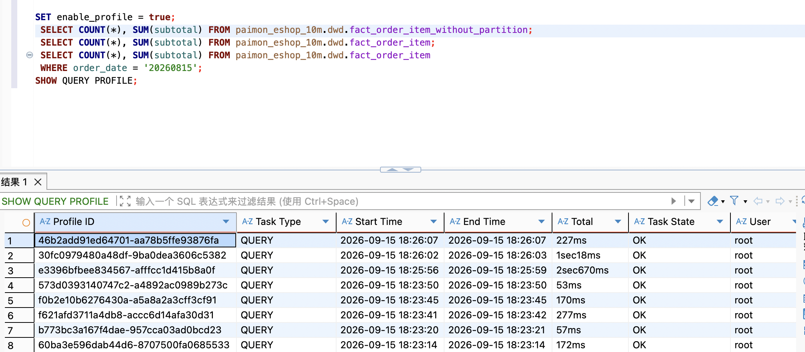

**结果记录**
| 规模 | 组 | 扫描文件数 | 扫描行数 | 扫描字节 | 查询耗时 |
|---|---|---:|---:|---:|---:|
| 100 万 | A | 4 | 1,699,595 | 57.7 MB | 277 ms |
| 100 万 | B | 1,393 | 1,699,595 | 154.7 MB | 170 ms | 
| 100 万 | C | 46 | 119,550 | 10.6 MB | 57.8 ms | 53 ms |
| 1000 万 | A | 38 | 16,998,581 | 1.42 GB | 2670 ms | 
| 1000 万 | B | 21,535 | 16,989,141 | 3.28 GB | 1018 ms | 
| 1000 万 | C | 699 | 1,207,261 | 244.6 MB | 227 ms | 

**实验结论**
- 决定 Paimon 扫描并行度的是「分区数 × 桶数」，不是文件数。 本表 bucket=2，无分区只有 2 个 split（并行度 2），按 31 天分区后变成 62 个 split（并行度 62，通过doris explain查看inputSplitNum），全表扫描因此快 2.73 倍 —— 尽管分区版文件数是 567 倍、字节数是 2.31 倍。

- 分区在两个场景各有收益：全表扫描靠提高并行度（A→B 2.73×），带分区过滤靠减少数据量（B→C 4.36×）。两者叠加时 1000 万档达到 A→C 11.9 倍。

- 反直觉点：无分区表"文件更少、字节更小"并不代表更快 —— 它的并行度被桶数锁死。要让无分区表提速，唯一旋钮是加大 bucket 数，而不是减少文件。


---

### 实验5、Paimon Bucket数量设置

**目的**
- 对比同一张表，Paimon Bucket数量对性能的影响。

**实验说明**

- 同样1000万条数据，建3张表，`bucket=2/4/8` 作为对照组。

<details>
<summary><strong>查询SQL (点击展开)</strong></summary>

```sql
-- 确认数据一致
SELECT 'bucket=2' AS 表, COUNT(*) AS 行数, SUM(total_amount) AS 金额
FROM paimon_eshop_10m.ods.fact_order_2_bucket
UNION ALL
SELECT 'bucket=4', COUNT(*), SUM(total_amount) FROM paimon_eshop_10m.ods.fact_order_4_bucket
UNION ALL
SELECT 'bucket=8', COUNT(*), SUM(total_amount) FROM paimon_eshop_10m.ods.fact_order_8_bucket;
-- 扫描并行度
EXPLAIN SELECT COUNT(*), SUM(total_amount) FROM paimon_eshop_10m.ods.fact_order_2_bucket;
EXPLAIN SELECT COUNT(*), SUM(total_amount) FROM paimon_eshop_10m.ods.fact_order_4_bucket;
EXPLAIN SELECT COUNT(*), SUM(total_amount) FROM paimon_eshop_10m.ods.fact_order_8_bucket;
-- 获取每桶文件、行数、字节数、平均每文件大小
SELECT 'bucket=2' AS 表, bucket AS 桶,
       COUNT(*)                                   AS 文件数,
       SUM(record_count)                          AS 行数,
       SUM(file_size_in_bytes)                    AS 字节,
       ROUND(AVG(file_size_in_bytes) / 1024, 0)   AS 平均文件KB
FROM paimon_eshop_10m.ods.`fact_order_2_bucket$files`
GROUP BY bucket
UNION ALL
SELECT 'bucket=4', bucket, COUNT(*), SUM(record_count), SUM(file_size_in_bytes),
       ROUND(AVG(file_size_in_bytes) / 1024, 0)
FROM paimon_eshop_10m.ods.`fact_order_4_bucket$files`
GROUP BY bucket
UNION ALL
SELECT 'bucket=8', bucket, COUNT(*), SUM(record_count), SUM(file_size_in_bytes),
       ROUND(AVG(file_size_in_bytes) / 1024, 0)
FROM paimon_eshop_10m.ods.`fact_order_8_bucket$files`
GROUP BY bucket
ORDER BY 表, 桶;
-- 计算指标
SELECT 表,
       SUM(文件数)                                                      AS 总文件数,
       SUM(行数)                                                        AS 总行数,
       ROUND(SUM(字节) / 1024.0 / 1024, 1)                              AS 总MB,
       ROUND(SUM(字节) * 1.0 / SUM(文件数) / 1024, 0)                   AS 平均文件KB,
       ROUND(AVG(行数), 0)                                              AS 单桶平均行数,
       MIN(最早)                                                        AS 写入起点,
       MAX(最晚)                                                        AS 写入终点,
       TIMESTAMPDIFF(SECOND, MIN(最早), MAX(最晚))                      AS 写入秒数,
       ROUND(SUM(行数) * 1.0
             / TIMESTAMPDIFF(SECOND, MIN(最早), MAX(最晚)), 0)         AS 写入吞吐_行每秒,
       ROUND(STDDEV_POP(行数) * 100.0 / AVG(行数), 4)                   AS 分布CV_pct
FROM (
  SELECT 'bucket=2' AS 表, bucket, COUNT(*) AS 文件数, SUM(record_count) AS 行数,
         SUM(file_size_in_bytes) AS 字节, MIN(creation_time) AS 最早, MAX(creation_time) AS 最晚
  FROM paimon_eshop_10m.ods.`fact_order_2_bucket$files` GROUP BY bucket
  UNION ALL
  SELECT 'bucket=4', bucket, COUNT(*), SUM(record_count), SUM(file_size_in_bytes),
         MIN(creation_time), MAX(creation_time)
  FROM paimon_eshop_10m.ods.`fact_order_4_bucket$files` GROUP BY bucket
  UNION ALL
  SELECT 'bucket=8', bucket, COUNT(*), SUM(record_count), SUM(file_size_in_bytes),
         MIN(creation_time), MAX(creation_time)
  FROM paimon_eshop_10m.ods.`fact_order_8_bucket$files` GROUP BY bucket
) t
GROUP BY 表
ORDER BY 表;

-- 单次耗时
SET enable_profile = true;
SELECT COUNT(*) AS cnt, SUM(total_amount) AS amount
FROM paimon_eshop_10m.ods.fact_order_2_bucket;
SHOW QUERY PROFILE;  
```

</details>

<details>
<summary><strong>查询截图 (点击展开)</strong></summary>

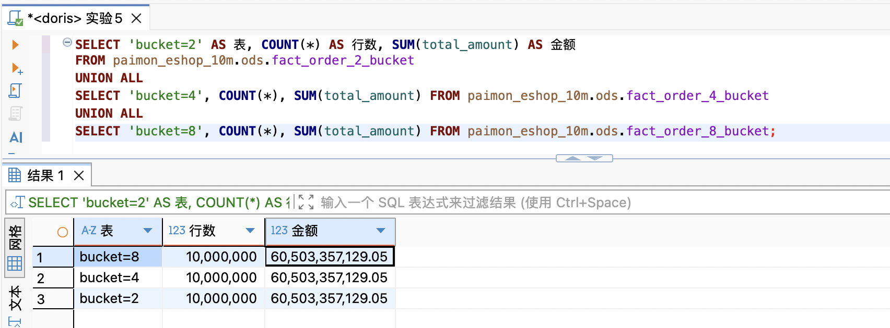
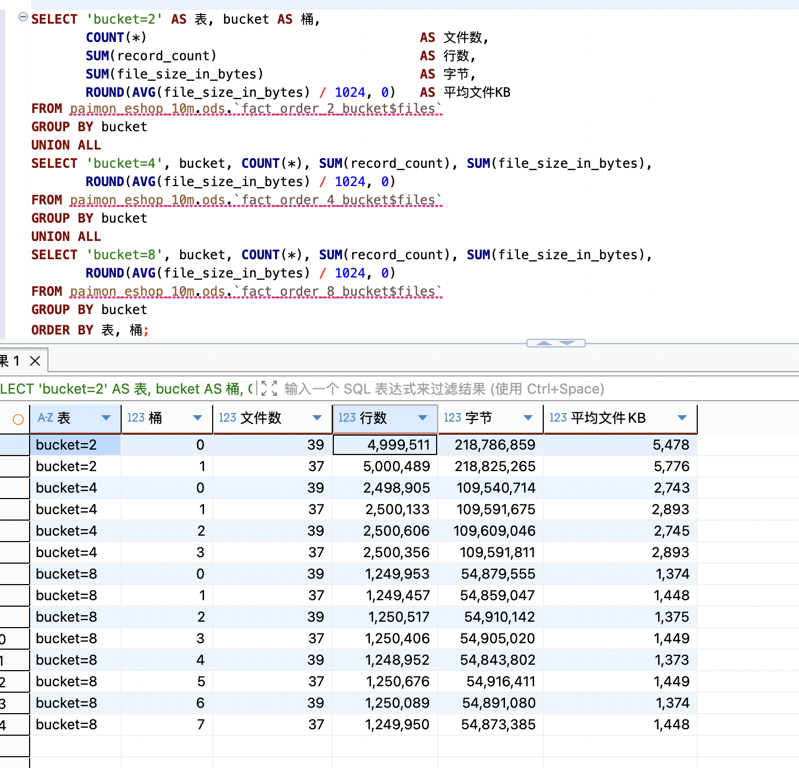
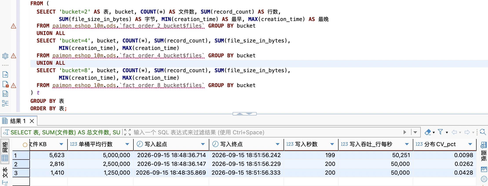

</details>

**结果记录**

| bucket  |写入吞吐| 总文件数 | 平均文件大小 | 单桶数据量 | 查询耗时 |upsert分布均匀度|
|---:|--|---:|---:|---:|---:|--:|
| 2 |50251行/秒 |76 | 5,623 KB| 5,000,000|588.9 ms |0.0098%|
| 4 |50000行/秒|152| 2,816 KB| 2,500,000|633.4 ms| 0.0262%|
| 8 |50000行/秒 |304| 1,410 KB| 1,250,000|707.7 ms | 0.0428%|

**实验结论**
- bucket 数通过「split 数 = 分区数 × 桶数」影响查询并行度，但存在最优值：≈ 可用核数。

- 本集群 12 核，本表 31 个分区 → bucket=2 已有 62 个 split，早已越过最优点,继续加大bucket只会增加查询耗时。
- 写入吞吐不受 bucket 影响（三档差 0.47%）—— 因为 sink.parallelism 固定为 2，写入并行度没变
- 存储几乎不受影响，文件数严格 = 38 × bucket
- 哈希分布均匀度极好（CV < 0.05%），bucket key 选 order_id 没问题
- 选型建议：partition 已提供足够并行度时，bucket 取最小值；只有当分区数很少（或不分区）时，bucket 才是主要的并行度旋钮。
---

### 实验6、Doris 分区裁剪 + Runtime Filter

**目的**
- 观察 Doris 内表的分区裁剪（Partition Pruning）与 Runtime Filter 分别对扫描量和查询延迟的优化效果。
- 验证 Runtime Filter 的等待成本是否可能超过它节省的时间。

**实验说明**
| 项 | 值 |
|---|---|
| 数据规模 | 1000 万订单明细（`dwd_eshop_10m.fact_order_item`，按 `dt` 日分区 × 8 桶，48 个分区中有数据的 31 个） |
| 对照组 | A：分区过滤 + Runtime Filter 开（`runtime_filter_mode='GLOBAL'`）<br>B：同 A，但 `SET runtime_filter_mode='OFF'`<br>C：去掉 `where` 做全表 join（基准） |
| 操作方法 | `EXPLAIN` 看计划（分区裁剪 / join 策略 / RF 类型），`profile_level=2` 看真实扫描量与 RF 计数器；延迟每组独立跑 5 次取中位数 |
| 观测对象 | `partitions=N/M`、`ScanRows`、`ScanBytes`、RF 类型、`RF* FilterRows`、`RF* WaitTime`、延迟 P50 |

<details>
<summary><strong>查询SQL (点击展开)</strong></summary>

```sql
-- ★ 测延迟/扫描量前必须关掉结果缓存，否则量到的是缓存命中（实测 Total=1ms、无扫描节点）
SET enable_sql_cache = false;
SET enable_profile    = true;
SET profile_level     = 2;

-- ============ A) 分区过滤 + Runtime Filter 开 ============
SET runtime_filter_mode = 'GLOBAL';
EXPLAIN
SELECT i.dt, p.category, COUNT(*) AS cnt, SUM(i.subtotal) AS gmv
FROM dwd_eshop_10m.fact_order_item i
JOIN dwd_eshop_10m.dim_product   p ON i.product_id = p.product_id
WHERE i.dt = '2026-09-13' AND p.category = '手机数码'
GROUP BY i.dt, p.category;

SELECT i.dt, p.category, COUNT(*) AS cnt, SUM(i.subtotal) AS gmv
FROM dwd_eshop_10m.fact_order_item i
JOIN dwd_eshop_10m.dim_product   p ON i.product_id = p.product_id
WHERE i.dt = '2026-09-13' AND p.category = '手机数码'
GROUP BY i.dt, p.category;

-- ============ B) 同 A，关掉 Runtime Filter ============
SET runtime_filter_mode = 'OFF';
SELECT i.dt, p.category, COUNT(*) AS cnt, SUM(i.subtotal) AS gmv
FROM dwd_eshop_10m.fact_order_item i
JOIN dwd_eshop_10m.dim_product   p ON i.product_id = p.product_id
WHERE i.dt = '2026-09-13' AND p.category = '手机数码'
GROUP BY i.dt, p.category;
SET runtime_filter_mode = 'GLOBAL';

-- ============ C) 去掉 where，全表 join（基准） ============
SELECT i.dt, p.category, COUNT(*) AS cnt, SUM(i.subtotal) AS gmv
FROM dwd_eshop_10m.fact_order_item i
JOIN dwd_eshop_10m.dim_product   p ON i.product_id = p.product_id
GROUP BY i.dt, p.category;

-- ============ 取执行层实测值 ============
SHOW QUERY PROFILE;
```

</details>


**结果记录**

| 组 | 分区裁剪 | Scan Rows | Scan Bytes | Runtime Filter 类型 | RF 过滤行数 | WaitForRF | 延迟 P50 |
|---|---|---|---:|---|---|---:|---:|
| A 分区+RF开 | **1/48** (`p20260913`) | 423,036 | 8.47 MB | `min_max` + `in_or_bloom` | **368,237** | 3~4 ms | **22 ms** |
| B 分区+RF关 | **1/48** | 423,036 | 8.47 MB | 无 | — | — | **16 ms** |
| C 全表 join（基准） | **31/48** | **16,989,141** | **340.35 MB** | 无 | — | — | **102 ms** |

三组查询结果一致（`dt=2026-09-13` / `手机数码`）：`cnt=52,963`，`gmv=609,899,773.84`。

延迟明细（每组 5 次，已关 `enable_sql_cache`；中位数 = 第 3 小）：

| 组 | 第1次(冷) | 第2次 | 第3次 | 第4次 | 第5次 | **中位数** |
|---|---:|---:|---:|---:|---:|---:|
| A 分区+RF开 | 26 ms | 21 ms | 20 ms | 24 ms | 22 ms | **22 ms** |
| B 分区+RF关 | 15 ms | 15 ms | 17 ms | 17 ms | 16 ms | **16 ms** |
| C 全表 join | 109 ms | 100 ms | 112 ms | 102 ms | 97 ms | **102 ms** |

计划层对照：

| 组 | fact 侧 `partitions=` | join 策略 | fact 扫描节点上的 RF |
|---|---|---|---|
| A | `1/48` | `INNER JOIN(COLOCATE[])` | `RF000[min_max] -> product_id`、`RF001[in_or_bloom] -> product_id` |
| B | `1/48` | `INNER JOIN(COLOCATE[])` | 无 |
| C | `31/48` | `INNER JOIN(COLOCATE[])` | 无 |

**实验结论**
- **分区裁剪是本实验的主要收益来源。** C→B：`ScanRows` 16,989,141 → 423,036（**40.2×**），
  `ScanBytes` 340.35 MB → 8.47 MB（**40.2×**），延迟 102 ms → 16 ms（**6.4×**）。
  计划层表现为 `partitions=31/48` → `1/48`，即只扫 `p20260913` 一个分区。

- **反直觉点被实测到：Runtime Filter 在本场景是负收益。**
  A（RF 开）22 ms **慢于** B（RF 关）16 ms，**慢了 37.5%**；
  两组 5 次测量分布完全不重叠（A 最小 20 ms > B 最大 17 ms），不是噪声。

- **原因：RF 在 scan 节点内部、数据读完**之后**才过滤，所以扫描量一点没降。**
  A 与 B 的 `ScanRows`（423,036）与 `ScanBytes`（8.47 MB）**完全相同**。
  RF 真正的作用只是把喂给 join 的行数从 `RF1 InputRows=421,200` 压到 52,963
  （`RF1 FilterRows=368,237`，滤除 **87.4%**），恰好等于查询结果的 `cnt=52,963`。
  但为这 87.4% 付出的代价是 `RF0/RF1 WaitTime` 3~4 ms 加上 bloom filter 构建开销，
  **超过了省下的那点 hash 探测成本**。

- 另外两个 RF 细节：
  - `RF0[min_max]` 基本不干活 —— `AlwaysTrueFilterRows=97,828`，因为 `product_id` 取值范围覆盖全表，
    min/max 区间裁剪不了什么；真正起作用的是 `RF1[in_or_bloom]`。
  - 本实验三组都是 **colocate join**，build 侧（`dim_product`）在每个 BE 本地就有，
    所以 RF 没有跨节点等待 —— 这也解释了 `WaitTime` 只有 3~4 ms。

- **适用边界**：本实验 build 侧只有 2,500 个值（占商品表 12.5%），选择率不算高；
  且 probe 侧虽大但 join 是本地 colocate、探测成本低。
  **只有当 probe 侧远大于 build 侧、且 join 需要跨节点搬数据时，Runtime Filter 才划算。**
  "小表驱动大表"并不总是优选。

---

### 实验7、Doris Colocate Join vs Shuffle Join

**目的**
- 验证 Colocate Join 能消除 Exchange 节点、消除网络 Shuffle。
- 量化 Colocate 的延迟收益，并说清它的前提：两表同 colocate 组、分布键 = Join 键、分桶数一致。

**实验说明**
| 项 | 值 |
|---|---|
| 数据规模 | 1000 万订单明细 × 2 万商品维（`fact_order_item` × `dim_product`） |
| 对照组 | A：Colocate Join（默认，两表同在 `dwd_eshop_10m.grp_eshop_10m_product`，均 `HASH(product_id) BUCKETS 8`）<br>B：同 A 的 SQL，`SET disable_colocate_plan = true` 强制不走 colocate<br>C：反例 —— 分桶数不一致（`fact_order_acc` 8 桶 join `dim_user` 4 桶，分布列相同） |
| 操作方法 | 三组只改 join 计划，SQL 与聚合逻辑不变；`EXPLAIN` 看有无 Exchange 与 join 策略，`profile_level=2` 看 `LocalBytesSent`/`BytesSent`；延迟每组 5 次取中位数 |
| 观测对象 | join 策略、join 下的 Exchange、`LocalBytesSent`、远端 `BytesSent`、`ProbeIntermediateRows`、延迟 P50 |

<details>
<summary><strong>查询SQL (点击展开)</strong></summary>

```sql
SET enable_sql_cache = false;
SET enable_profile    = true;
SET profile_level     = 2;

-- ============ 0) 先确认 colocate 组状态（IsStable 必须为 true） ============
SHOW PROC '/colocation_group';
-- 实测：dwd_eshop_10m.grp_eshop_10m_product | BucketsNum=8 | IsStable=true

-- ============ A) Colocate Join（默认） ============
SET disable_colocate_plan = false;
EXPLAIN
SELECT p.category, COUNT(*) AS cnt, SUM(i.subtotal) AS gmv
FROM dwd_eshop_10m.fact_order_item i
JOIN dwd_eshop_10m.dim_product   p ON i.product_id = p.product_id
GROUP BY p.category;
-- ★ 期望：join op = INNER JOIN(COLOCATE[])，join 下无 EXCHANGE

-- ============ B) 强制 Shuffle Join ============
-- ★ 注意：Doris 4.0.7 里没有 disable_colocate_join，正确变量是 disable_colocate_plan
SET disable_colocate_plan = true;
EXPLAIN
SELECT p.category, COUNT(*) AS cnt, SUM(i.subtotal) AS gmv
FROM dwd_eshop_10m.fact_order_item i
JOIN dwd_eshop_10m.dim_product   p ON i.product_id = p.product_id
GROUP BY p.category;
-- ★ 期望：join op = INNER JOIN(BUCKET_SHUFFLE[])，且 join 下出现 VEXCHANGE
SET disable_colocate_plan = false;

-- ============ C) 反例：分桶数不一致，Colocate 天然不成立 ============
-- fact_order_acc = HASH(user_id) BUCKETS 8 ； dim_user = HASH(user_id) BUCKETS 4
EXPLAIN
SELECT u.city, COUNT(*) AS cnt, SUM(a.total_amount) AS amt
FROM dwd_eshop_10m.fact_order_acc a
JOIN dwd_eshop_10m.dim_user      u ON a.user_id = u.user_id
GROUP BY u.city;
-- ★ 实测：join op = INNER JOIN(BROADCAST[])，也有 VEXCHANGE

-- ============ 执行层：网络 Shuffle 量 ============
SHOW QUERY PROFILE;
-- 关注 LocalBytesSent / LocalSentRows（本地重分布）与 BytesSent（远端网络传输）
```

</details>


**结果记录**

| 指标 | A Colocate Join | B Shuffle（`disable_colocate_plan=true`） | C 桶数不一致（8 vs 4） |
|---|---|---|---|
| join 策略 | `INNER JOIN(COLOCATE[])` | `INNER JOIN(BUCKET_SHUFFLE[])` | `INNER JOIN(BROADCAST[])` |
| **join 下有无 Exchange** | **无** | **有** (`1:VEXCHANGE`) | **有** (`1:VEXCHANGE`) |
| `LocalBytesSent`（本地重分布） | **736 B** | **489 KB** | **18.1 MB** |
| 远端 `BytesSent`（真实网络传输） | 3.7 KB | 3.7 KB | **18.8 MB** |
| probe 侧 `ScanRows` | 16,989,141 | 16,989,141 | 10,000,000 |
| 查询延迟 P50 | **109 ms** | **104 ms** | **204 ms** |
| 相对 A 的倍数 | 1.00× | 0.95× | 1.87× |

延迟明细（每组 5 次，中位数 = 第 3 小）：

| 组 | 第1次(冷) | 第2次 | 第3次 | 第4次 | 第5次 | **中位数** |
|---|---:|---:|---:|---:|---:|---:|
| A Colocate | 109 ms | 98 ms | 106 ms | 133 ms | 130 ms | **109 ms** |
| B Shuffle | 104 ms | 113 ms | 102 ms | 114 ms | 104 ms | **104 ms** |
| C 桶数不一致 | 198 ms | 217 ms | 188 ms | 207 ms | 204 ms | **204 ms** |

**实验结论**
- **Colocate Join 确实消除了 Exchange —— 这是计划层的确定性证据。**
  A 的 join 是 `INNER JOIN(COLOCATE[])`，join 下方**没有 Exchange 节点**；
  B 关闭 colocate 后立刻变成 `INNER JOIN(BUCKET_SHUFFLE[])` 且 join 下多出 `1:VEXCHANGE`。
  两者 SQL 完全相同，唯一变量是 `disable_colocate_plan`。

- **但延迟几乎没有差别（A 109 ms vs B 104 ms），因为被搬动的数据量太小。**
  B 只搬了 `LocalBytesSent=489 KB`（`dim_product` 只有 20,000 行），而 A 是 736 B。
  **489 KB 的本地重分布在 100 ms 级的查询里量不出来。**

- **所以本实验最稳的证据是「计划里有没有 Exchange」，不是延迟。**
  "没有 Exchange" ≠ "更快"：colocate 的真实收益 = **省下的数据搬动量**，
  搬动量小的时候收益自然小。要放大延迟差异，得让被 shuffle 的那一侧变大。

- **C 组就是"搬动量大"的对照：** 分桶数不一致（8 vs 4）导致 colocate 不成立，
  Doris 对 `dim_user`（100 万行）选择了 **BROADCAST**，产生 **18.8 MB 真实网络传输**，
  延迟 204 ms，是 A 的 **1.87 倍**。这量化了 colocate 失效的代价量级。

- **选型建议**：事实表与常用维表应**同 colocate 组 + 同分桶数 + join 键 = 分布键**；
  本项目的 `fact_order_item` / `dim_product` 正是按这个规则建的（DDL 带 `colocate_with`），
  而 `fact_order_acc`(8 桶) 与 `dim_user`(4 桶) 不一致 —— 属于 DDL 层面可低成本修掉的隐患。

---

### 实验8、Doris 物化视图 / 预聚合

**目的**
- 验证异步物化视图能否被**透明改写**命中（auto rewrite），以及预聚合对扫描量和延迟的降幅。
- 量化 MV 的代价（额外存储 + 构建刷新开销），说清什么查询值得建 MV。

**实验说明**
| 项 | 值 |
|---|---|
| 数据规模 | 1000 万订单明细 join 2 万商品维，聚合粒度 = 天 × 品类（31 × 8 = 248 行） |
| 对照组 | A：无 MV，直接查明细表做 join + 聚合<br>B：建 MV 后跑**同一条 SQL**，由优化器自动改写命中<br>C：显式查 MV（作为性能下限基准） |
| 操作方法 | 建异步物化视图并刷新；`EXPLAIN` 看是否改写为扫 MV；`profile_level=2` 看 ScanRows/ScanBytes；延迟每组 5 次取中位数 |
| 观测对象 | 是否命中 MV、Scan Rows/Bytes、延迟 P50、MV 行数与存储、降幅 |

<details>
<summary><strong>查询SQL (点击展开)</strong></summary>

```sql
SET enable_sql_cache = false;
SET enable_profile    = true;
SET profile_level     = 2;

-- ============ A) 建 MV 前：直接查明细聚合（基线） ============
EXPLAIN
SELECT i.dt, p.category, COUNT(*) AS cnt, SUM(i.subtotal) AS gmv
FROM dwd_eshop_10m.fact_order_item i
JOIN dwd_eshop_10m.dim_product   p ON i.product_id = p.product_id
GROUP BY i.dt, p.category;
-- 实测计划：扫 fact_order_item 全部 31 个有数据的分区

-- ============ 建异步物化视图 ============
CREATE MATERIALIZED VIEW IF NOT EXISTS dwd_eshop_10m.mv_trade_category_day
BUILD IMMEDIATE REFRESH AUTO ON MANUAL
DISTRIBUTED BY HASH(dt) BUCKETS 4
PROPERTIES ('replication_num' = '1')
AS
SELECT i.dt AS dt, p.category AS category, COUNT(*) AS cnt, SUM(i.subtotal) AS gmv
FROM dwd_eshop_10m.fact_order_item i
JOIN dwd_eshop_10m.dim_product   p ON i.product_id = p.product_id
GROUP BY i.dt, p.category;

-- 查看构建任务状态（实测 TaskId 126001440053146 / SUCCESS）
SELECT TaskId, Status, ErrorMsg FROM tasks('type'='mv') ORDER BY CreateTime DESC LIMIT 3;
SHOW MATERIALIZED VIEWS FROM dwd_eshop_10m;

-- ============ B) 建 MV 后：跑同一条 SQL，看是否自动改写 ============
EXPLAIN
SELECT i.dt, p.category, COUNT(*) AS cnt, SUM(i.subtotal) AS gmv
FROM dwd_eshop_10m.fact_order_item i
JOIN dwd_eshop_10m.dim_product   p ON i.product_id = p.product_id
GROUP BY i.dt, p.category;
-- ★ 期望：TABLE 变成 dwd_eshop_10m.mv_trade_category_day

-- ============ C) 显式查 MV（性能下限基准） ============
EXPLAIN
SELECT dt, category, cnt, gmv FROM dwd_eshop_10m.mv_trade_category_day;

-- ============ MV 的代价 ============
SELECT COUNT(*) AS mv行数 FROM dwd_eshop_10m.mv_trade_category_day;
SHOW DATA FROM dwd_eshop_10m.mv_trade_category_day;
```

</details>


**结果记录**

| 指标 | A 无 MV（查明细） | B 有 MV（自动改写） | C 显式查 MV | 降幅 A→B |
|---|---:|---:|---:|---:|
| 是否命中 MV | 否 | **是** | — | — |
| Scan Rows | **16,989,141** | **248** | 248 | **68,504×** |
| Scan Bytes | **340.35 MB** | **11.47 KB** | 11.47 KB | **30,400×** |
| 查询延迟 P50 | **99 ms** | **14 ms** | **7 ms** | **7.07×** |

MV 的代价：

| 项 | 值 |
|---|---|
| MV 行数 | 248（31 天 × 8 品类） |
| MV 存储 | **16.551 KB**（4 个 tablet） |
| 构建任务 | `TaskId 126001440053146` / `SUCCESS` |
| 相对明细表的压缩比 | 340.35 MB → 16.551 KB ≈ **21,000×** |

延迟明细（每组 5 次，中位数 = 第 3 小）：

| 组 | 第1次(冷) | 第2次 | 第3次 | 第4次 | 第5次 | **中位数** |
|---|---:|---:|---:|---:|---:|---:|
| A 无 MV | 99 ms | 97 ms | 98 ms | 102 ms | 105 ms | **99 ms** |
| B 有 MV（自动改写） | 16 ms | 14 ms | 16 ms | 14 ms | 12 ms | **14 ms** |
| C 显式查 MV | 10 ms | 7 ms | 7 ms | 7 ms | 7 ms | **7 ms** |

**实验结论**
- **透明改写成功命中。** 建 MV 后，**完全没改一个字**的同一条 SQL，`EXPLAIN` 的扫描目标
  从 `dwd_eshop_10m.fact_order_item` 变成了 `dwd_eshop_10m.mv_trade_category_day`，
  并且计划里明确给出 `CBO.internal.dwd_eshop_10m.mv_trade_category_day chose`。
  前提是 `enable_materialized_view_rewrite`（默认 `true`，本次已确认）。

- **收益量级**：`ScanRows` 16,989,141 → 248（**68,504×**），
  `ScanBytes` 340.35 MB → 11.47 KB（**30,400×**），延迟 99 ms → 14 ms（**7.07×**）。
  注意**扫描量的降幅远大于延迟降幅** —— 因为 99 ms 里还有相当一部分是调度、聚合、结果组装等
  与数据量无关的固定开销，这部分不会被 MV 消掉。

- **B（14 ms）比 C（7 ms）慢一倍**：自动改写要额外做"MV 匹配 + 改写决策"，
  这部分是纯开销。**改写不是免费的**，只是在高基数据面前可以忽略。

- **代价必须一起报**：MV 占 16.551 KB 存储、248 行，构建一次 `SUCCESS`。
  相对 340 MB 的明细扫描，这是 **21,000× 的存储压缩换 7 倍的查询加速**。

- **适用边界**：异步 MV 的改写要求**查询与 MV 定义等价**（同样的 join 关系、聚合粒度、
  可推导的过滤条件）。所以只有**被高频重复的固定聚合形态**才值得建 MV；
  明细点查、维度组合多变的即席查询命中不了，那就变成"白占一份存储"。
  这与实验 6 的 compaction 结论同构：**都是拿写入时的计算/存储换查询时的扫描量，
  "开着就好"和"建得越多越好"都不成立。**

- **反直觉点**：MV 的收益**不体现在"聚合变快了"，而体现在"扫描量塌缩了"**。
  本例延迟只降 7 倍，但扫描量降了 3 万倍 —— 如果查询瓶颈在 CPU/网络而非 IO，
  MV 的帮助会远小于预期。
